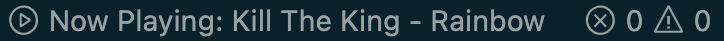

# tidal-now-playing README

This extension lets you see the currently playing song on Tidal.

## License

MIT and free for all to use. If you like the extension, feel free to donate here:

## Limitations

- It only works for Mac and has been tested on Ventura.
- The status updates every 5 seconds so there might be a slight delay until you see the most recent information.

## Additional Commands

There are 3 additional commands which you can access by the VS Code shortcuts menu (CMD+SHIFT+P):

1. Toggle Play/Pause
2. Next Track
3. Previous Track
